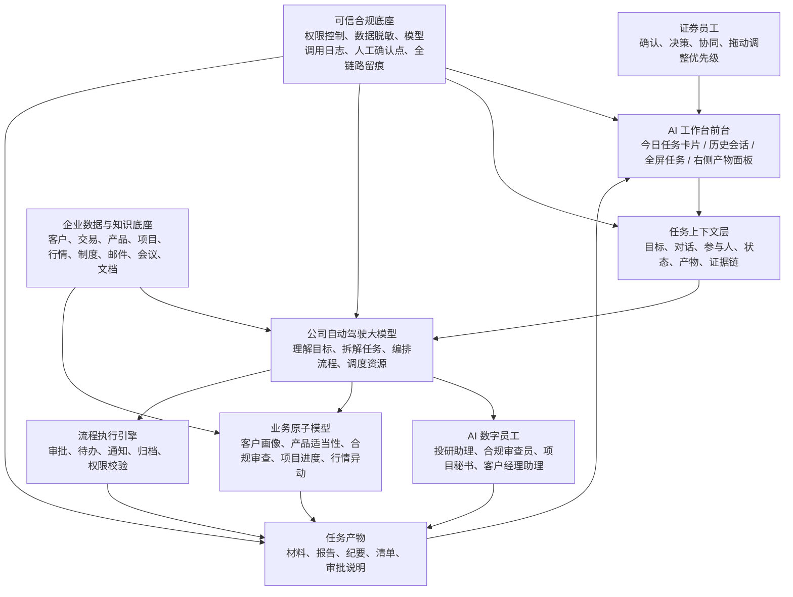

# 证券员工 AI 工作台设计方案

## 一、产品定位

证券员工 AI 工作台不是传统系统门户，也不是多个通用大模型的入口集合，而是一个由公司自动驾驶大模型驱动的“任务型 AI 工作空间”。

员工进入后默认看到“今日任务牌组”。每张卡片代表一项真实业务任务，卡片标题就是任务名称。AI 已经在后台完成部分处理，员工在卡片中确认、补充、协同和推进。

核心主张：

> 任务即 AI，工作即队列，员工即指挥官。

工作台采用同一套页面框架支持不同角色视角。普通一线业务人员进入后看到“今日任务执行现场”，重点是处理客户、项目、合规、材料和协同任务；领导进入后看到“经营管理驾驶现场”，重点是经营摘要、风险预警、项目督办、团队阻塞和会议决策。

角色切换不改变产品结构，只改变任务内容、快捷入口和处理重点。这说明工作台不是一套固定页面，而是公司自动驾驶大模型根据人、岗、事动态组织出来的个性化工作界面。

## 二、首页结构

首页由四个关键区域组成：

1. 顶部极简栏：保留历史入口、AI 工作台标题、角色视角切换、AI 预处理状态和当前用户，不放英文说明和业务 Tab。
2. 横向任务牌组：进入后直接展示约 5 个 AI 任务卡片，不放大段说明、指标卡和筛选标签。首屏大约露出 3 个半到 4 个任务卡片，右侧箭头可查看后续任务，左侧箭头可返回前面的任务。
3. 底部个性化快捷入口：输入框上方展示由自动驾驶大模型生成的常用入口，员工和领导看到的内容不同。
4. 底部全局输入框：用户输入工作目标后，系统在任务牌组最前面生成新任务卡片，任务自然增长到 6 个、7 个或 8 个。

任务卡片支持长按或拖动顶部排序。员工可以把更重要的工作拖到前面，把暂缓处理的任务放到后面，卡片顺序就是当天工作的优先级。界面不需要显示明显的拖动把手，保持 WorkBuddy、Codex 类产品的简洁感。

任务卡片不是模型名称，而是任务标题，例如：

- 客户拜访准备
- 产品推荐材料合规审查
- 投行项目周报
- 昨日会议纪要待确认
- 新能源板块异动解读

领导视角下，任务卡片会替换成管理类任务，例如：

- 待领导审批事项
- 高风险事项预警
- 重点项目推进看板
- 今日会议安排提醒

这些卡片强调“批事项、抓风险、督项目、看会议”，与一线员工的执行型任务形成对照。会议准备不再单独成卡，而是融入“今日会议安排提醒”，把会议日程、会前材料和需要提前确认的问题放在同一张卡里。

## 三、个性化快捷入口

输入框上方的气泡快捷入口不是固定菜单，而是个人常用工作入口。公司自动驾驶大模型会根据用户岗位、历史会话、常办业务、近期任务和个人习惯动态生成；用户也可以通过 `+` 号自行配置常用提示词、Skill、MCP、业务入口和外部 AI 工具。

一线业务人员视角的快捷入口偏执行：

- 客户拜访
- 合规检查
- 生成材料
- 会议纪要
- 业务推荐

其中“业务推荐”放在最后，点击后展开多项证券业务，例如财富管理业务推荐、投行业务机会识别、机构客户服务建议、融资融券业务提醒、产品适配建议、客户流失风险挽回。

领导视角的快捷入口偏管理：

- 审批事项
- 风险预警
- 项目督办
- 会议安排

`+` 号里的配置内容在两个角色下保持一致，代表个人工具配置中心，包括配置 AI 工具、添加 Skill、添加 MCP、添加常用提示词、添加业务入口和管理快捷气泡。

## 四、任务卡片信息结构

每张任务卡片包含：

- 任务标题
- 所属业务
- 当前责任人或 AI 数字员工
- 右上角最新状态
- 任务具体内容
- AI 已判断并完成的内容
- 员工需要进一步处理的事项
- 当前任务最近对话
- 当前任务独立输入框
- 关联标签
- 嵌入每条处理建议后的动作按钮
- 图标化全屏展开入口
- 卡片顶部拖动排序能力

卡片内容不应机械地以“任务说明”呈现，而应从当前登录用户关心这一事项的角度组织信息。会议类卡片优先展示时间、地点、议题和主次安排；审批类卡片优先展示待批事项、截止时间、影响范围和建议意见；风险类卡片优先展示风险等级、影响对象和处置动作。注意事项、准备材料和模型处理过程作为弱层级信息，供用户需要时继续查看。

卡片右上角状态是员工判断工作优先级的核心，例如：

- AI 处理中
- 待你确认
- 发现 2 个风险点
- AI 已生成初稿
- 王敏已加入
- 已完成

每张卡片本身就是一个小型 AI 对话框。员工不需要展开全屏，也可以直接在卡片底部输入补充要求。不同任务卡片的对话上下文相互独立，员工可以先在第一张卡片发一句话，再在第二张卡片发一句话，让多个任务同时进入 AI 处理状态，并在各自卡片中看到最新回复。

卡片高度固定，页面进入后可以完整看到卡片和底部全局 AI 输入框。卡片内部内容可以上下滚动，横向移动不再依赖浏览器滚动条，而是使用左右箭头翻动任务牌组。

卡片不展示单独的进度条，避免占用信息空间。下一步动作不再集中放在输入框上方，而是跟随在每条“你需要进一步处理”的建议后面，例如“确认周报初稿是否可发送”后面直接跟“确认周报”按钮，让建议和操作形成一一对应关系。

对于有正式文件产物的任务，例如“投行项目周报”，卡片会额外展示“周报重点”和“查看周报源文件”入口。员工点击后可以查看周报源文件的主要内容，包括本周进展、监管反馈、当前卡点和下周计划。

## 五、外部 AI 工具卡片

工作台除了公司自动驾驶大模型生成的任务卡片，也支持员工自定义加入外部 AI 工具卡片，例如豆包、智谱清言、DeepSeek、通义千问、Kimi、Trae 等。

外部 AI 工具卡片本质上是该工具网页的缩小工作窗口。员工可以根据个人习惯选择只保留一个，也可以同时加入多个。工具卡片与任务卡片并排展示，但交互规则不同：

- 扩展：打开该 AI 工具的原始网页。
- 钉住：每天进入工作台时继续保留该工具卡片。
- 关闭：从当前工作台移除，需要再次通过配置重新打开。

配置入口放在底部输入框上方的 `+` 菜单中，点击“配置 AI 工具”后进入多选面板。用户勾选需要的 AI 工具并应用，即可把对应工具卡片加入工作台。

AI 工具卡片也可以和任务卡片一起拖动排序，用户可以把豆包、Trae 等工具拖到任务中间，甚至拖到第一位。拖动排序只改变卡片显示顺序，不刷新内嵌网页，因此工具中的既有对话不会丢失。

## 六、全局输入生成新任务

员工可以在底部输入框输入自然语言目标。

示例：

“帮我准备下午拜访华东高净值客户的材料。”

发送后，系统自动完成：

1. 在今日任务牌组最前面创建新卡片。
2. 公司自动驾驶大模型理解目标。
3. 拆解任务路径。
4. 匹配业务原子模型和数据源。
5. 生成初步产物。
6. 更新卡片状态为“待你确认”。

这个交互将 AI 从“问答工具”变成“工作发起器”。

## 七、历史会话设计

首页保持当日任务优先，但保留历史会话入口。

用户点击左上角菜单，打开历史会话侧边栏。侧边栏中按时间展示历史任务会话，用户点击后进入对应任务的完整上下文。

用户从历史会话返回或将任务缩小后，会回到当日 AI 工作台面板。

这种设计兼顾两点：

- 首页不被历史聊天记录淹没。
- 所有任务上下文仍然可追溯、可复用、可审计。

## 八、任务全屏态

每个任务卡片可以展开到全屏。

全屏态采用左右结构：

左侧：任务对话和执行过程。

- AI 处理记录
- 员工补充意见
- 系统提醒
- 多人协同消息
- 后续执行指令

右侧：任务产物面板。

- 当前任务生成的文件
- 关联业务原子模型
- 参考物和证据链

这种形态参考 WorkBuddy、Codex 等主流 AI 工作空间设计，让“对话”和“产物”并列存在。

展开和收回都使用图标按钮，不使用“全屏展开”“缩小回卡片”等文字按钮，保持页面克制简洁。

## 九、右侧产物面板

右侧面板分为三组：

1. 任务产物：PPT、Word、PDF、表格、纪要、审批材料等。
2. 业务原子模型：客户画像模型、产品适当性模型、合规审查模型、项目进度模型等。
3. 参考物与证据链：CRM 记录、制度条款、底稿、邮件、会议录音、行情数据等。

这样员工不仅看到 AI 结果，也能看到结果来自哪里、调用了什么能力、是否可追溯。

## 十、多人协同逻辑

任务对话框支持 @ 其他员工。

流程如下：

1. 员工在任务卡片底部输入框中输入 `@王敏 请帮我确认第 2 条适当性说明`。
2. 系统向王敏发送协作邀请，并同步当前任务上下文、产物和待确认点。
3. 王敏的工作台自动新增一张“协同邀请”任务卡片，卡片中展示邀请人、任务信息和邀请内容。
4. 被邀请卡片使用明显标识，例如左侧强调线、协同邀请标签和高亮提醒。
5. 王敏接受后进入任务会话，当前任务状态更新为“协同中”。
6. 多人可以共同查看产物、补充信息、确认风险、推进审批。

任务会话成为围绕具体业务事项的临时协同空间。

## 十一、完整闭环

一个任务从创建到完成的闭环如下：

1. AI 自动发现任务，或员工手动输入创建任务。
2. 自动驾驶大模型拆解目标并调度业务原子模型。
3. AI 数字员工生成摘要、材料、风险提示和下一步建议。
4. 员工在任务卡片中确认或展开全屏处理。
5. 必要时 @ 同事加入协同。
6. 关键动作由人工确认。
7. 系统生成产物并保留证据链。
8. 任务完成后归档为历史会话。

## 十二、汇报重点

建议向领导突出三个创新点：

第一，前台不是模型入口，而是任务入口。员工不关心调用哪个模型，只关心每件工作处理到哪一步。

第二，AI 不只是回答问题，而是提前处理任务。员工打开工作台时，AI 已经把当天大量工作预处理到“待确认”状态。

第三，工作台不是个人聊天工具，而是公司级智能协同入口。它把员工、AI 数字员工、业务原子模型、数据和流程组织到一个任务空间里。

## 十三、底层逻辑架构图

